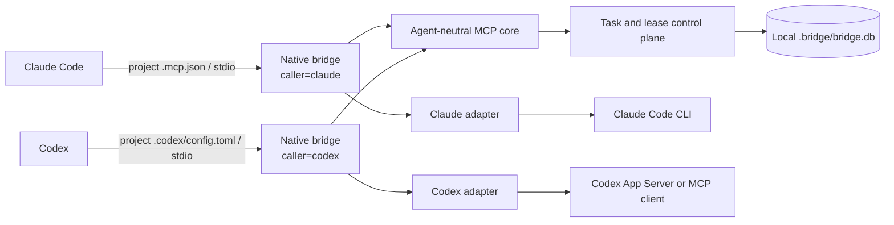

# Claude Code ↔ Codex coordination bridge

> **Status: Experimental · Pre-1.0 · under active development · not production-certified.**
> This is the first experimental open-source release. APIs, MCP tool shapes, persisted state,
> and workflows may change without notice and without a migration path. Use it only in
> trusted local repositories on work you can review.

A local, repository-scoped coordination bridge that lets **Claude Code** and **Codex** work in
the same checkout without stepping on each other. It gives both agents one shared control
plane for tasks, ownership, write-scope leases, artifacts, verification evidence, recovery,
and runtime telemetry, exposed to each client as a native project-scoped MCP server.

The bridge is a coordination layer. It does not choose the better model, split work
automatically, or merge code for you.

## Table of contents

- [What problem it solves](#what-problem-it-solves)
- [Project status and honest limits](#project-status-and-honest-limits)
- [Architecture](#architecture)
- [Requirements](#requirements)
- [Installation](#installation)
- [Quick start](#quick-start)
- [Project-scoped MCP configuration](#project-scoped-mcp-configuration)
- [The `using-bridge` skill](#the-using-bridge-skill)
- [Bounded delegation](#bounded-delegation)
- [Ownership and leases](#ownership-and-leases)
- [Recovery](#recovery)
- [Telemetry](#telemetry)
- [Troubleshooting](#troubleshooting)
- [Security and privacy](#security-and-privacy)
- [Contributing](#contributing)
- [Release policy](#release-policy)
- [Documentation map](#documentation-map)

## What problem it solves

Running two coding agents in one repository creates coordination problems that neither client
solves on its own. The bridge addresses them with explicit mechanisms:

| Coordination problem | Implemented mechanism |
| --- | --- |
| Conflicting edits | Expiring leases over repo-relative path globs |
| Duplicate ownership | Explicit task claim and owner checks |
| Premature work | Dependency gate before `WORKING` |
| Unverifiable completion | Passing evidence required for `COMPLETE` |
| Lost handoffs | Structured deliverables and hashed artifacts |
| Interrupted runtimes | Persisted opaque handles and strict same-task resume |
| Recursive delegation | Parent/depth validation, ancestor checks, and deadlines |
| Runtime observability | One normalized final telemetry record per attempt |
| Claude profile drift | Bridge-owned `opus` / `high` launch profile with actual-model validation |
| Caller spoofing | Identity bound when the MCP process starts |

## Project status and honest limits

### Demonstrated on this implementation

- real Claude Code → bridge → Codex delegation;
- real Codex → bridge → Claude Code delegation;
- native project-scoped MCP integration for both clients;
- task ownership and time-bounded write-scope leases;
- structured deliverables with real verification evidence;
- persisted Claude and Codex execution handles;
- same-task, same-runtime-session recovery after interruption;
- runtime-reported token telemetry for both workers;
- startup-bound caller identity and anti-spoofing checks;
- server-side delegation allow/deny;
- parent/depth validation and ancestor-loop protection;
- deterministic regression coverage (`npm test`).

### Explicitly **not** established

- superiority over single-agent workflows;
- token savings or economic efficiency of any kind;
- production security or production readiness;
- large-scale, multi-user, or long-horizon reliability;
- benchmark advantage over either agent alone;
- optimal or automatic routing of work between models.

Controlled Claude-alone versus Codex-alone versus bridged benchmarking is planned but has
**not** been completed. This repository makes no performance, cost, or security claim beyond
what its committed tests and redacted evidence show.

## Architecture



Each client launches the same composition root, `scripts/native-bridge-mcp.mjs`, with a
different startup-bound caller. The two processes coordinate through one repository-local
SQLite database. The neutral dependency direction is:

```text
@bridge/protocol
        ↓
@bridge/control-plane
        ↓
@bridge/mcp-server-core
        ↓
Claude and Codex adapters
```

Details: [docs/architecture.md](docs/architecture.md). Normative wire contract:
[docs/PROTOCOL.md](docs/PROTOCOL.md).

## Requirements

- **Node.js >= 22.13.0** — required, because `node:sqlite` is used without an experimental CLI
  flag. The `engines` field in `package.json` enforces the same floor.
- npm (workspaces) and Git.
- Claude Code and Codex installed and authenticated, for real delegations.
- A trusted local checkout. The bridge launches coding runtimes that can read, write, and run
  shell commands.

## Installation

The supported workflow is deterministic and uses the committed lockfile:

```bash
npm ci          # deterministic install from package-lock.json
npm run build   # tsc --build; required before a client opens the bridge
npm test        # vitest run; the deterministic regression suite
```

`npm ci` (not `npm install`) is what makes the dependency tree reproducible. The native
launcher imports **compiled** workspace packages, so `npm run build` must succeed before you
open the bridge from a client. Run the suite yourself rather than trusting a recorded test
count in prose.

Optional checks: `npm run typecheck` forces a clean type build, and `npm run links:check`
inspects workspace package links (use `npm run links:fix` only when it reports a break).

More detail: [docs/installation.md](docs/installation.md).

## Quick start

1. Clone the repository and `cd` into it.
2. Run `npm ci && npm run build && npm test`.
3. Verify MCP discovery from the repository root:
   ```bash
   claude mcp list     # expect a "bridge" server, caller=claude
   codex mcp list      # expect a "bridge" server, caller=codex
   ```
   On Windows without a global Codex on `PATH`, use `.\node_modules\.bin\codex.cmd mcp list`.
4. Launch either client from the repository root and approve the project-scoped MCP server
   when prompted. Inside Claude Code, `/mcp` shows the active connections.
5. Ask the client to use the `using-bridge` skill for one bounded delegation, then read the
   two worked examples in [Bounded delegation](#bounded-delegation).

## Project-scoped MCP configuration

Both configuration files are committed, repository-relative, and contain no credentials.
Neither creates a global MCP registration.

**Claude Code — `.mcp.json`:**

```json
{
  "mcpServers": {
    "bridge": {
      "type": "stdio",
      "command": "node",
      "args": [
        "${CLAUDE_PROJECT_DIR:-.}/scripts/native-bridge-mcp.mjs",
        "--caller", "claude",
        "--delegation", "allow",
        "--workspace", "${CLAUDE_PROJECT_DIR:-.}"
      ],
      "env": {}
    }
  }
}
```

**Codex — `.codex/config.toml`:**

```toml
[mcp_servers.bridge]
command = "node"
args = ["scripts/native-bridge-mcp.mjs", "--caller", "codex", "--delegation", "allow"]
cwd = "."
startup_timeout_sec = 30
tool_timeout_sec = 1800
```

Caller identity is bound when the server process starts. A tool call that contradicts the
bound caller is rejected; an omitted caller field resolves to it. Starting the launcher with
`--delegation deny` keeps inspection and telemetry available while refusing `bridge_delegate`
server-side.

Review both files before granting project trust, and never hand-edit client trust state.

## The `using-bridge` skill

The same bounded-coordination skill is committed for both native clients:

- Claude Code: [`.claude/skills/using-bridge/SKILL.md`](.claude/skills/using-bridge/SKILL.md)
- Codex: [`.codex/skills/using-bridge/SKILL.md`](.codex/skills/using-bridge/SKILL.md)

Open a client from this repository and ask it to **use the `using-bridge` skill** when a
bounded delegation, independent review, recovery, or telemetry lookup is genuinely useful. The
skill keeps the current client responsible for the user's request, defaults to one child with
zero retries, and explicitly does not treat "use both models" as a reason to delegate. Only
these shared skill files are versioned; other client-local state stays ignored.

## Bounded delegation

A delegation is one bounded request and one structured answer — never an open conversation
between agents. Every `DelegationRequest` carries a deadline, the root `run_id`, the parent
`task_id`, and a depth. Inputs are artifact IDs, not transcripts.

### Example: Codex → Claude

Ask Codex, running from the repository root:

> Use the bridge MCP. Confirm `caller=codex`, then create and claim one depth-0 root task for
> "review the lease-expiry logic". Delegate exactly one depth-1 child to Claude with scope
> `(no-write)/**`, a 10-minute deadline, `max_attempts: 0`, and the verification criterion
> "cites concrete file:line evidence". Consume the child's structured deliverable, verify it
> yourself, then submit the root deliverable. Report lineage, final states, and worker
> telemetry without exposing execution handles.

### Example: Claude → Codex

Ask Claude Code, running from the repository root:

> Use the bridge MCP. Confirm `caller=claude`, then create and claim one depth-0 root task for
> "add a regression test for expired-lease renewal". Delegate exactly one depth-1 child to
> Codex with write scope `shared/control-plane/src/**`, a 15-minute deadline,
> `max_attempts: 0`, and the verification criterion "`npm test` passes". Consume the child's
> structured deliverable, verify it yourself, then submit the root deliverable. Report
> lineage, final states, and worker telemetry without exposing execution handles.

In both directions the manager stays responsible for the user's request, `bridge_server_info`
is confirmed once per native session, and `bridge_snapshot` is used only when concurrent
ownership is plausible. If the target runtime is unavailable, report the runtime failure —
do not create a replacement child task.

### Claude worker profile

The **bridge runtime**, not the manager and not the skill, owns Claude model selection. Every
bridge-created Claude worker — fresh or resumed — is launched through Claude Code's supported
interface with `--model opus --effort high`. A delegation payload cannot override that
profile. If Claude Code reports an actual non-Opus model, the attempt fails with
`RUNTIME_PROFILE_MISMATCH`; if it reports no model at all, telemetry keeps the actual model
`null` rather than inventing one.

Claude turn ceilings are finite: minimum 1, conservative default 12, maximum 64, with 32 as
the recommended starting value for a bounded repository audit. Set `TaskSpec.max_turns` only
when the default is genuinely too small; the value persists with the task and is reused on
strict recovery.

Full workflow: [docs/usage.md](docs/usage.md).

## Ownership and leases

- Exactly one agent **owns** a task. Claiming a task is not permission to write.
- Before editing files, the owner acquires a **lease** over repo-relative glob patterns
  (`*`, `**`, `?`). An overlapping live lease held by a different agent is refused with
  `SCOPE_CONFLICT`.
- Overlap detection is deliberately conservative: when two patterns cannot be proven disjoint,
  the bridge reports a conflict. A false conflict costs a retry; a false clearance costs
  corrupted files.
- Leases are time-bounded and expire lazily against an injected clock, so a crashed agent
  cannot deadlock the repository and tests stay deterministic. Renewing a lapsed lease is
  refused, because the scope may already belong to someone else.
- A read-only task declares `(no-write)/**` and returns `changed_scope: []`.

These are coordination contracts enforced by the control plane. They are **not** an
operating-system sandbox: a delegated runtime with shell access can still write outside its
declared scope, which is why the bridge is for trusted local repositories only.

## Recovery

Adapters persist an opaque runtime handle (a Claude session id, a Codex thread id) as soon as
the session exists — not on completion, because the only time anyone needs it is when the run
died. `bridge_resume_task` lets the task owner request strict recovery;
`bridge_resume_delegated_task` lets a manager request recovery of the direct child it
delegated while the child owner remains the execution identity. Both take only the durable
task ID (plus optional idempotency), derive owner, lineage, scope, runtime, and handle from
SQLite, reject live or conflicting leases, take a fresh worker-owned lease, create the
adjacent attempt, and require strict resume of that exact runtime session. Neither accepts a
caller-supplied handle nor opens a replacement task or thread.

See [docs/recovery.md](docs/recovery.md).

## Telemetry

The bridge records one normalized final record per attempt: worker identity, lineage, timing,
token, cache, cost, turn, artifact, and termination fields — but only when the runtime reports
them authoritatively. Unknown values stay `null`; missing manager tokens are never estimated,
and cached token counts are subdimensions of input, not extra tokens to add again. Raw
prompts, responses, authentication data, and execution handles are outside the durable
telemetry schema.

Runtime-reported cost is not confirmed billing. See [docs/telemetry.md](docs/telemetry.md).

## Troubleshooting

Common first stops: the bridge is not listed by `claude mcp list` / `codex mcp list`, the
server starts but tools fail, `SCOPE_CONFLICT` on every lease, a task is stranded after an
interrupted run, or telemetry fields are `null`. Each case, with the exact check to run, is in
[docs/troubleshooting.md](docs/troubleshooting.md).

## Security and privacy

The bridge is local-first, but it launches powerful coding runtimes. Leases stop cooperating
agents from claiming overlapping scopes; they do not confine shell commands at the operating
system level, and nothing here has been audited for production use.

Never commit or publish:

- `.bridge/` SQLite databases or WAL/SHM sidecars;
- Claude or Codex trust state;
- raw handles, prompts, transcripts, runtime frames, or credentials;
- logs, temporary task directories, `node_modules`, coverage, or build output.

Review `git status`, staged paths, and secret-scan results before any push. To report a
suspected vulnerability, see [docs/security.md](docs/security.md#reporting-a-vulnerability).

## Contributing

Contributions are welcome, with small, local, evidence-backed changes preferred. Read
[CONTRIBUTING.md](CONTRIBUTING.md) before opening a pull request; it covers the local gates,
the evidence standard, the claim discipline this project applies to itself, and repository
hygiene rules.

## Release policy

Pre-1.0 and experimental: no compatibility guarantee, no support commitment, no security
certification. Breaking changes may land in any release and are recorded in
[CHANGELOG.md](CHANGELOG.md). The stability rules, versioning scheme, and what would have to
be true before a 1.0 are in [docs/release-policy.md](docs/release-policy.md).

The project is licensed under the [MIT License](LICENSE). Package manifests remain `private`
because this release publishes source on GitHub, not packages to the npm registry.

## Documentation map

- [Architecture](docs/architecture.md) — packages, data flow, invariants
- [Installation](docs/installation.md) — requirements, deterministic setup, project MCP config
- [Usage](docs/usage.md) — manager workflow, worked examples, writing tasks
- [Telemetry](docs/telemetry.md) — recorded fields, sources, privacy boundary
- [Recovery](docs/recovery.md) — persisted handles, strict same-task resume
- [Troubleshooting](docs/troubleshooting.md) — symptoms, checks, and fixes
- [Security and privacy](docs/security.md) — trust boundary, controls, disclosure
- [Release policy](docs/release-policy.md) — versioning and stability expectations
- [Roadmap](docs/roadmap.md) — current phase and what is out of scope
- [Normative protocol](docs/PROTOCOL.md) — lifecycle, tools, error codes
- [Bridge skill context pack](BRIDGE_SKILL_CONTEXT_PACK.md) — background on the skill design
- [Contributing](CONTRIBUTING.md) · [Changelog](CHANGELOG.md)
