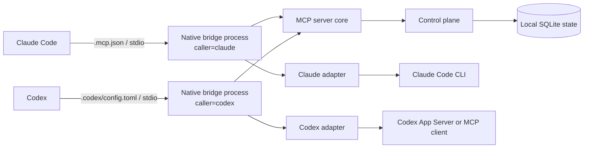

# Architecture

The structure below describes the current experimental, pre-1.0 implementation. Package
boundaries, the persisted schema, and the tool surface may change; see
[release-policy.md](release-policy.md).

## Context

The bridge coordinates Claude Code and Codex while both work in one local repository. It
does not choose the better model or merge code automatically. Its job is to make ownership,
write scope, task lineage, verification, and recovery explicit.

Each native process binds its caller identity and delegation policy at startup. Separate
processes coordinate through the same repository-local SQLite database.

## Packages and dependency direction

- `@bridge/protocol`: schemas, types, error codes, scope rules, and adapter contracts; no
  runtime dependencies.
- `@bridge/control-plane`: tasks, attempts, leases, artifacts, events, deliverables,
  telemetry, and SQLite persistence; depends only on the protocol.
- `@bridge/mcp-server-core`: agent-neutral MCP tools and lifecycle; depends on the protocol
  and control plane, never an agent-specific package.
- `@bridge/claude-side` and `@bridge/codex-side`: runtime-specific adapters. Neither imports
  the other.
- `scripts/native-bridge-mcp.mjs`: the project-scoped composition root that combines the
  neutral core with both adapters.

## Main data flow

1. A manager creates and claims a bounded root task.
2. Before writing, an owner acquires a time-limited lease over repo-relative path globs.
3. `bridge_delegate` creates one child task with validated run, parent, and depth lineage.
4. The adapter invokes the target runtime under a deadline and returns a structured
   deliverable.
5. The control plane persists task state, verification, artifacts, events, execution-handle
   pointers, and final attempt telemetry.
6. A `COMPLETE` result reaches `DONE` only with passing verification and no failing check.

## Invariants and trade-offs

- The control plane is the only state writer.
- Scope overlap is conservative: an uncertain comparison conflicts rather than risking an
  unsafe concurrent write.
- Leases expire; they are not permanent locks.
- Execution handles are opaque pointers, not transcripts, and are excluded from telemetry
  exports.
- stdout belongs to MCP JSON-RPC; diagnostics use stderr.
- The bridge is local and single-repository. It is not a multi-machine scheduler or an
  operating-system sandbox.

The normative lifecycle and tool contract are in [PROTOCOL.md](PROTOCOL.md). Historical
decisions are recorded in [COORDINATION/DECISIONS.md](../COORDINATION/DECISIONS.md).
